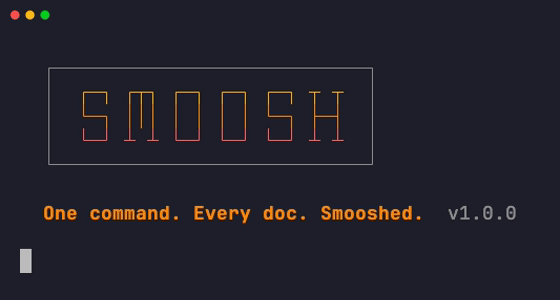

<div align="center">



[](https://github.com/K1-R1/smoosh/actions/workflows/ci.yml)
[](LICENSE)
[](https://github.com/K1-R1/smoosh/releases/latest)
[](https://www.gnu.org/software/bash/)
[](#installation)
[](#installation)

Turn any git repo into AI-ready context — for NotebookLM, Claude Projects,
ChatGPT, or your own RAG pipeline. Pure bash, zero dependencies.


</div>

**[Quick Start](#quick-start)** · **[Why smoosh?](#why-smoosh)** · **[Features](#features)** · **[Installation](#installation)** · **[Uninstall](#uninstall)** · **[Usage](#usage)** · **[AI Tools](#using-smoosh-with-ai-tools)** · **[Agent / CI](#agents-and-ci-pipelines)** · **[Config Reference](#configuration-reference)** · **[FAQ](#faq)**

## Quick Start

```bash
# Install
brew install K1-R1/tap/smoosh

# In any git repo:
smoosh           # docs only (default)
smoosh --code    # docs + code files
smoosh --all     # everything tracked by git
```

Output lands in `_smooshes/` — chunked, verified `.md` files ready to
drop into your AI tool of choice.

## Why smoosh?

Getting an entire codebase into an AI tool — right format, within token
limits, no secrets — is the tedious part. smoosh does it in one command.

**Understand your codebase in plain language.** Upload smoosh output to
NotebookLM and ask questions about architecture, module boundaries, or what
that obscure utility actually does. Product, design, and leadership get
answers without reading source files.

**Give AI real context.** Drop the output into Claude Projects
or ChatGPT and get an assistant that actually knows your codebase. No
hallucinated function signatures, no "I don't have access to that file." It
can answer questions about any file, understand cross-module relationships,
and suggest changes that fit your existing patterns.

**Onboard in hours.** New team members get a searchable snapshot
of the entire codebase before they even clone the repo. Pair it with
NotebookLM and they can ask the codebase questions on day one.

**Ground your agents in fact.** smoosh output is optimised for
retrieval-augmented generation (RAG) — chunked within token limits, with
file path metadata preserved. Instead of hallucinating, your agents retrieve
real context from your actual code.

**Private by default.** Everything runs locally. Your code never leaves your
machine unless you choose to upload it. No API keys, no SaaS accounts, no
telemetry.

## Features

- **File type presets** — `--docs` (default: md, rst, txt, adoc), `--code` (adds all code extensions), `--all` (everything)
- **Smart chunking** — stays within word limits; names chunks `project_part1.md`, `project_part2.md`
- **100% verification** — every chunk is integrity-checked against the expected file list; exits 4 on mismatch
- **Interactive mode** — guided first-run experience: scans your repo, shows a breakdown, lets you pick a mode
- **Remote repositories** — `smoosh https://github.com/user/repo` — clones and processes in one step
- **Secrets detection** — warns about AWS keys, GitHub PATs, PEM private key blocks; honest about scope
- **Output formats** — Markdown (default), plain text, XML with CDATA sections
- **Table of contents** — `--toc` generates a per-chunk file index with word counts
- **Line numbers** — `--line-numbers` for code review workflows
- **Dry run** — `--dry-run` shows what would be included with word counts, no files written
- **Agent-native** — designed to be called by AI agents and CI pipelines, not just humans. `--json` for structured output, `--no-interactive` for headless runs, exit codes 0–7 for programmatic decision-making

### Power user workflow

Preview, filter, and pipe — all from flags:


## Installation

### Homebrew (macOS / Linux)

```bash
brew install K1-R1/tap/smoosh
```

### curl (macOS / Linux / Git Bash)

```bash
curl -fsSL https://raw.githubusercontent.com/K1-R1/smoosh/main/install.sh | bash
```

Installs to `/usr/local/bin`. Override with:

```bash
SMOOSH_INSTALL_DIR="$HOME/.local/bin" \
  curl -fsSL https://raw.githubusercontent.com/K1-R1/smoosh/main/install.sh | bash
```

The installer supports these environment variables:

| Variable | Default | Description |
| --- | --- | --- |
| `SMOOSH_INSTALL_DIR` | `/usr/local/bin` | Installation directory |
| `SMOOSH_VERSION` | latest | Pin a specific version (e.g. `1.0.2`) |
| `SMOOSH_NO_CONFIRM` | `0` | Set to `1` to skip confirmation prompt |
| `SMOOSH_NO_VERIFY` | `0` | Set to `1` to skip checksum verification (unsafe) |

### Manual

```bash
curl -fsSL https://github.com/K1-R1/smoosh/releases/latest/download/smoosh -o smoosh
curl -fsSL https://github.com/K1-R1/smoosh/releases/latest/download/smoosh.sha256 -o smoosh.sha256
sha256sum -c smoosh.sha256
chmod +x smoosh
sudo mv smoosh /usr/local/bin/
```

### Uninstall

```bash
# Homebrew
brew uninstall smoosh

# curl / manual
rm "$(which smoosh)"
```

If you installed via both methods, check `which smoosh` after removing one — a
second copy may remain in a different location.

## Usage

### Basics

```bash
smoosh                              # interactive mode when run with no args
smoosh .                            # current directory (docs mode)
smoosh /path/to/repo                # specific local repo
smoosh https://github.com/user/repo # remote repo — clone + process in one step
```

### File types

```bash
smoosh --docs    # markdown, rst, txt, adoc, asciidoc, org, tex (default)
smoosh --code    # docs + py, js, ts, rs, go, java, rb, and many more
smoosh --all     # everything tracked by git (binary files excluded via MIME check)
```

### Filtering

```bash
smoosh --only "*.py"                   # Python files only (overrides mode)
smoosh --include "*.vue,*.graphql"     # add extensions to current mode
smoosh --exclude "vendor/*,test/*"     # exclude matching paths
smoosh --include-hidden                # include .github/, .env.example, dotfiles
```

### Output options

```bash
smoosh --format md             # Markdown with ### File: headers (default)
smoosh --format text           # plain text with === separators
smoosh --format xml            # XML with CDATA sections (for structured pipelines)
smoosh --toc                   # table of contents in each chunk
smoosh --line-numbers          # prefix each line with its number
smoosh --max-words 200000      # custom chunk size (default: 450,000)
smoosh --output-dir ./context  # write to a custom directory
```

### Preview and automation

```bash
smoosh --dry-run               # show file list + word counts, no output written
smoosh --quiet                 # print output paths only, one per line (for piping)
smoosh --json                  # structured JSON to stdout
smoosh --no-interactive        # skip interactive mode, use flag defaults
smoosh --no-check-secrets      # skip the secrets scan
```

### Combining flags

```bash
# Full code review context with TOC and line numbers
smoosh --code --toc --line-numbers

# Python-only export for a RAG pipeline
smoosh --only "*.py" --format xml --output-dir ./pipeline-input

# Preview what a remote repo contains before processing
smoosh --dry-run https://github.com/user/repo

# Quiet mode for scripting
files=$(smoosh --quiet --code .)
echo "Generated: ${files}"
```

## Using smoosh with AI tools

### NotebookLM

**Step 1 — Install smoosh**

```bash
brew install K1-R1/tap/smoosh
```

**Step 2 — Run smoosh in your repo**

```bash
cd your-project
smoosh          # docs only — usually the right start
```

Output lands in `your-project/_smooshes/`:

```bash
smoosh --code
```

**Step 3 — Upload to NotebookLM**

1. Go to [notebooklm.google.com](https://notebooklm.google.com) and create a notebook.
2. Click **Add source** → **Upload file**.
3. Upload each `.md` file from `_smooshes/`.
4. For large repos with multiple chunks, upload all of them.

**Step 4 — Chat with your codebase**

Ask about architecture, find functions, or get plain-English explanations
of complex modules — all with source citations.

**NotebookLM limits (as of early 2026):**

| Plan | Sources per notebook | Words per source |
| --- | --- | --- |
| Free | 50 | 500,000 |
| Plus | 300 | 500,000 |
| Ultra | 600 | 500,000 |

smoosh warns you when your repo produces more chunks than your plan allows.

### Claude Projects

1. Run `smoosh --code` in your repo.
2. Create a new [Claude Project](https://claude.ai) and open the project knowledge panel.
3. Upload the files from `_smooshes/`.

Claude now has full context over your codebase — ask about any file, request
changes that fit your existing patterns, or get architecture explanations
grounded in your actual code.

### ChatGPT

1. Run `smoosh --code` in your repo.
2. Open a ChatGPT conversation and attach the files from `_smooshes/`.
3. For ongoing use, add them as knowledge files in [ChatGPT](https://help.openai.com/en/articles/8843948-knowledge-in-gpts).

Works with any ChatGPT plan that supports file uploads.

### Agents and CI pipelines

smoosh is designed to be called by AI agents and CI pipelines, not just humans.

**Pre-flight check** — estimate size before generating output:

```bash
smoosh --json --dry-run --all .
```

```json
{
  "dry_run": true,
  "repo": "my-project",
  "files": [
    {"path": "README.md", "words": 194, "chunk": 1},
    {"path": "src/main.py", "words": 312, "chunk": 1}
  ],
  "total_words": 506,
  "estimated_tokens": 658,
  "estimated_chunks": 1
}
```

**Generate output:**

```bash
smoosh --no-interactive --json --all .
```

**Key flags for automation:**

| Flag | Purpose |
| --- | --- |
| `--no-interactive` | Skip TTY detection and prompts |
| `--json` | Structured JSON to stdout (status messages go to stderr) |
| `--quiet` | Output file paths only, one per line |
| `--dry-run` | Preview without writing files |
| `--no-color` | Disable colour escape codes |

Exit codes 0–7 are differentiated for programmatic decision-making — see
[Configuration Reference](#configuration-reference) below.

## Configuration Reference

| Flag | Default | Description |
| --- | --- | --- |
| `--docs` | yes | Include markdown, RST, TXT, AsciiDoc, Org, TeX |
| `--code` | — | Include docs + all code file types |
| `--all` | — | Include everything tracked by git |
| `--only GLOB` | — | Restrict to matching extensions (overrides mode) |
| `--include GLOB` | — | Add extensions to the current mode |
| `--exclude GLOB` | — | Exclude matching paths (comma-separated) |
| `--include-hidden` | — | Include dotfiles and dot-directories |
| `--max-words N` | 450000 | Words per output chunk |
| `--format FORMAT` | `md` | Output format: `md`, `text`, or `xml` |
| `--toc` | — | Add a table of contents to each chunk |
| `--line-numbers` | — | Prefix each line with its line number |
| `--output-dir PATH` | `_smooshes` | Directory for output files |
| `--dry-run` | — | Preview only — no output files written |
| `--quiet` | — | Print output paths only (stdout) |
| `--json` | — | Structured JSON to stdout |
| `--no-interactive` | — | Skip interactive mode even in a TTY |
| `--no-color` | — | Disable colour output |
| `--no-check-secrets` | — | Skip the basic secrets scan |
| `--version` | — | Print version and exit 0 |
| `--help` | — | Print full usage and exit 0 |

**Colour control:** `--no-color` flag > `NO_COLOR` env var > `FORCE_COLOR` >
`CLICOLOR` > TTY auto-detect. See [no-color.org](https://no-color.org/).

**Exit codes:**

| Code | Meaning |
| --- | --- |
| 0 | Success |
| 1 | Invalid flags or arguments |
| 2 | Path not found or not a git repository |
| 3 | No matching files for current mode/filters |
| 4 | Verification failed — expected/actual file list mismatch |
| 5 | Remote clone failed (network, auth) |
| 7 | Write permission denied |
| 130 | Interrupted (Ctrl-C) |

## FAQ

**Does smoosh respect `.gitignore`?**
Yes. It uses `git ls-files` which honours `.gitignore`. Untracked,
ignored files are excluded by default.

**What about large repos?**
smoosh chunks output at `--max-words` (default 450,000 words). Large repos
produce multiple files named `project_part1.md`, `project_part2.md`, and so on.

**Is the secrets detection reliable?**
No — it catches common patterns (AWS access keys, GitHub PATs, PEM private key
blocks) but is not a substitute for dedicated tools like
[gitleaks](https://github.com/gitleaks/gitleaks) or
[truffleHog](https://github.com/trufflesecurity/trufflehog). smoosh says this
clearly when it warns.

**Can I use smoosh with other AI tools?**
Yes — Gemini, Copilot, local models, custom pipelines. The output is plain
Markdown, compatible with anything that accepts text files. Use
`--format text` or `--format xml` if your tool prefers a different format.

**Does it work on Windows?**
smoosh is tested on macOS and Linux. On Windows, use Git Bash or WSL.

**The `_smooshes/` directory appeared in my git status — is that normal?**
smoosh adds `_smooshes/` to your `.gitignore` automatically on first run.
If it still appears, check that your `.gitignore` syntax is correct.

**Why is my word count different from what I expected?**
smoosh counts words using `wc -w`, which splits on whitespace. Code files
with dense syntax (JSON, minified JS) count differently than prose.

**Is it overengineered for a shell script?**
Absolutely. 231 tests, 100% file inclusion verification, CDATA escaping for
XML output, and a box-drawing letter logo. But your codebase deserves to be
smooshed properly.

## Contributing

See [CONTRIBUTING.md](CONTRIBUTING.md) for development setup, code style,
and the PR process.

## License

MIT — see [LICENSE](LICENSE).
